# 雷霆 UNOplus 玩家说明

《雷霆 UNOplus》是一款网页端实时多人 UNO 变体游戏。玩家创建房间后，把 6 位房间号发给其他人即可一起对战。当前支持 3 到 8 人游玩，也支持在无质疑模式下添加机器人。

规则以本项目的自定义规则为准，不是标准 UNO。完整规则可继续查看 [GAME-RULES.md](./GAME-RULES.md)，牌库配置可查看 [CARD-CONFIG.md](./CARD-CONFIG.md)。

## 快速开始

1. 打开网页。
2. 输入昵称。
3. 点击“生成房间号”创建房间，或输入别人给你的 6 位房间号加入房间。
4. 非房主点击“准备”。
5. 所有人准备后，房主点击“开始游戏”。
6. 轮到自己时，选择高亮手牌出牌，或点击摸牌。

房主还可以在大厅踢出玩家或机器人。机器人只能在“无质疑规则”模式下添加。

## 游戏目标

最先打光手牌的玩家获胜。

如果玩家手牌超过 25 张，会被淘汰。淘汰玩家不再参与回合流转，但房间内仍会显示其状态。

## 基础规则

每名玩家开局获得 7 张手牌。系统翻开一张非黑色牌作为起始牌。

普通出牌需要满足以下任一条件：

- 颜色相同。
- 数字相同。
- 牌型允许接入当前状态。
- 黑色牌可主动指定后续颜色。

示例：

- 当前是红 5，可以出红色牌。
- 当前是红 5，也可以出其他颜色的 5。
- 当前颜色被黑牌指定为蓝色，则下一家按蓝色接牌。

基础规则图示：

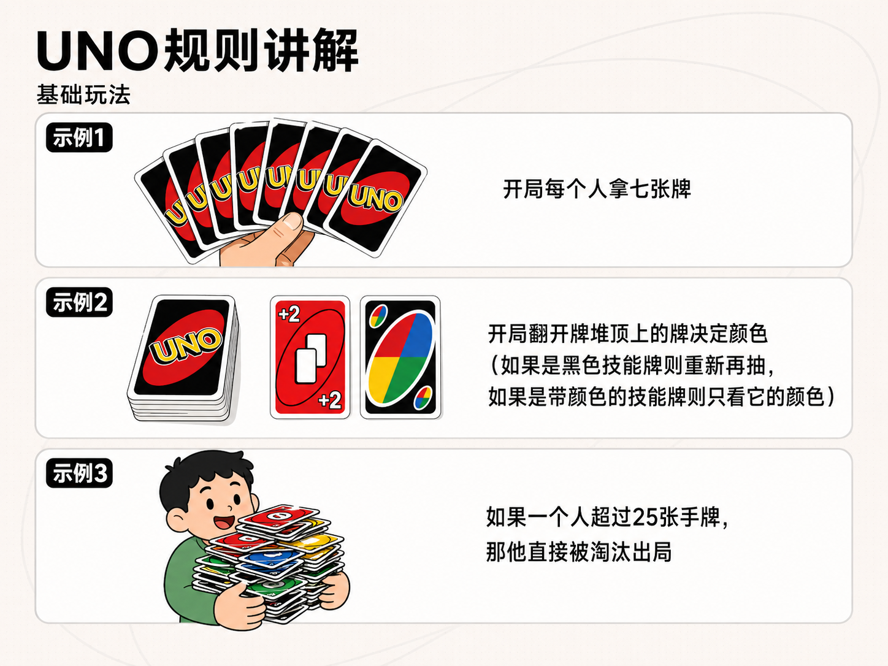

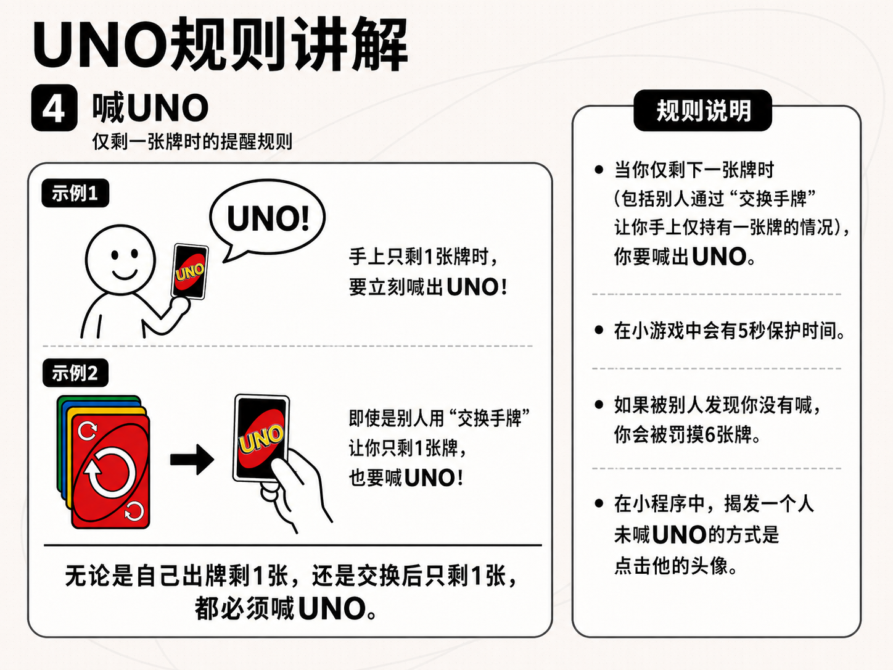

## 常见牌型

### 数字牌

普通数字牌按颜色或数字接牌。

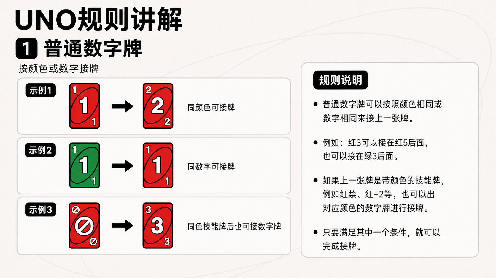

### +2 和 +4

普通 +2、普通 +4 属于带颜色的加牌牌。被加牌的玩家可以继续叠合法加牌，或结算当前加牌链。

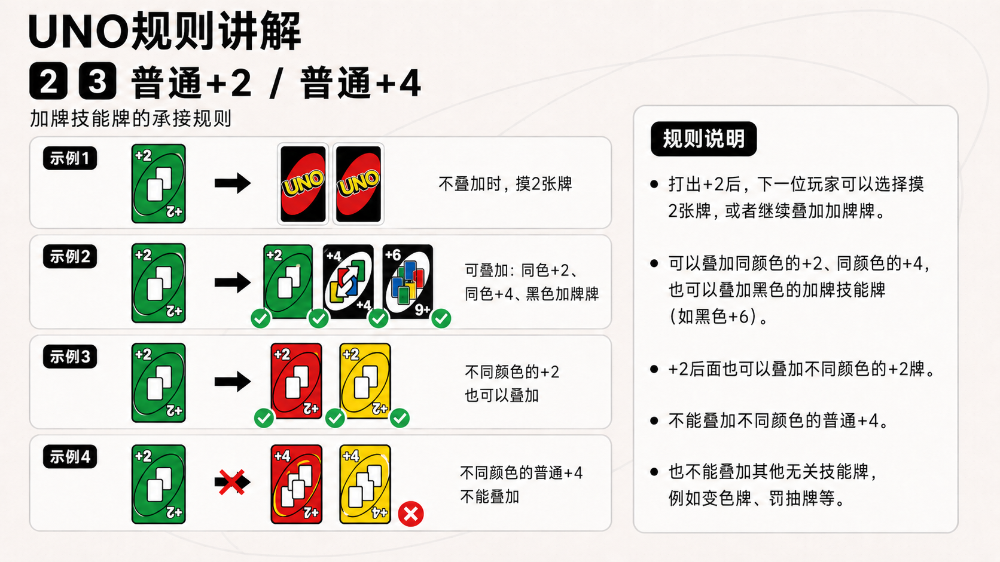

### 禁

跳过当前方向上的下一位玩家。

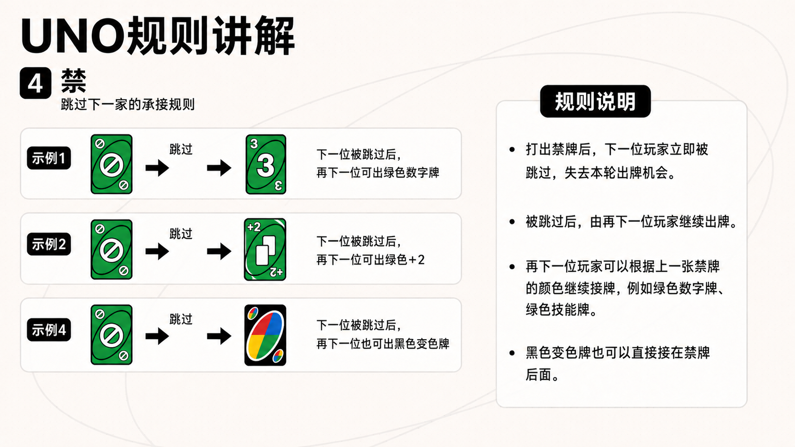

### 反转

改变当前出牌方向。

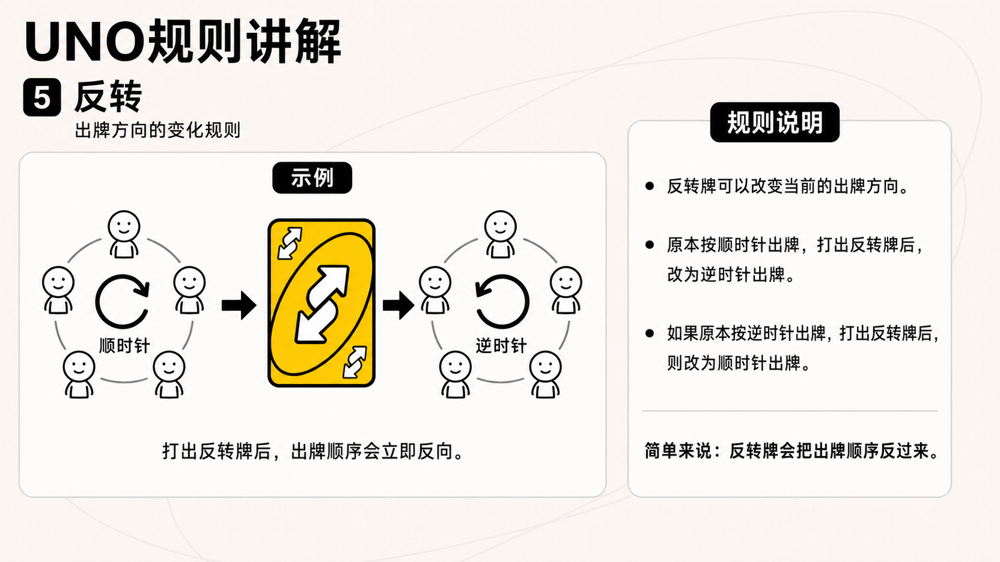

### 同色丢弃

打出“同色丢弃”后，可以额外丢出同颜色的若干张牌。额外丢出的牌不会触发技能效果，真正留在桌面上供下一家接牌的是“同色丢弃”主牌。

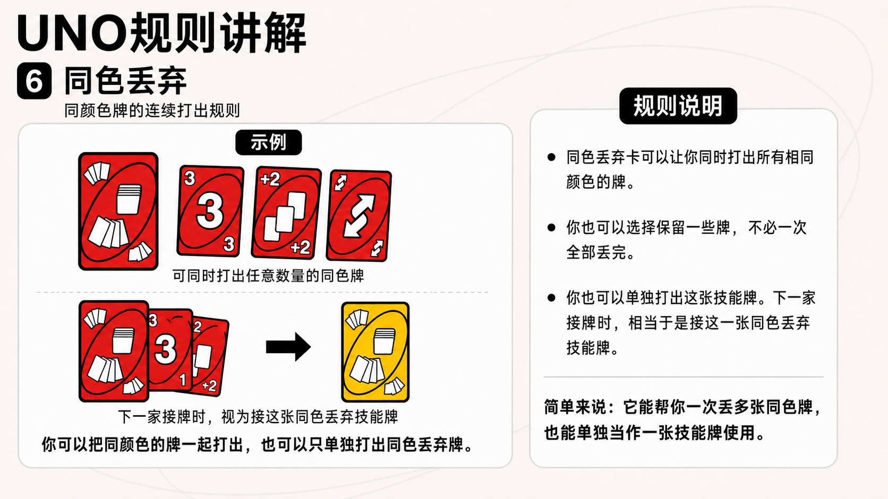

### 交换手牌

按当前方向交换所有玩家的手牌。

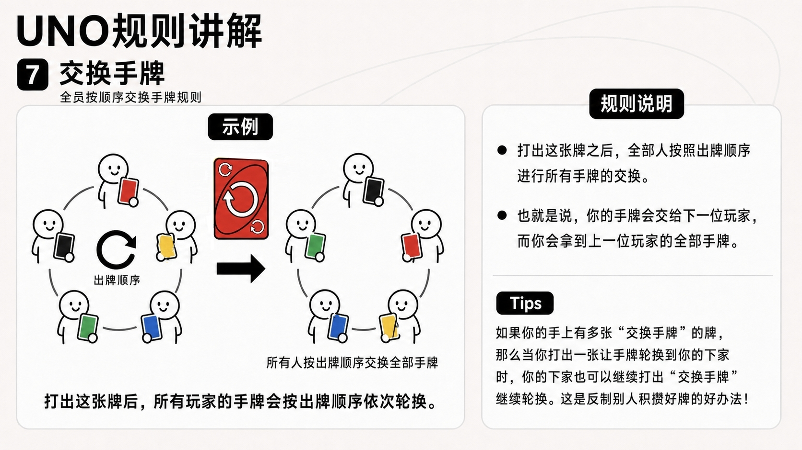

## 黑色牌

黑色牌通常可以指定后续颜色。

### 变色

打出后选择红、黄、蓝、绿之一作为后续颜色。

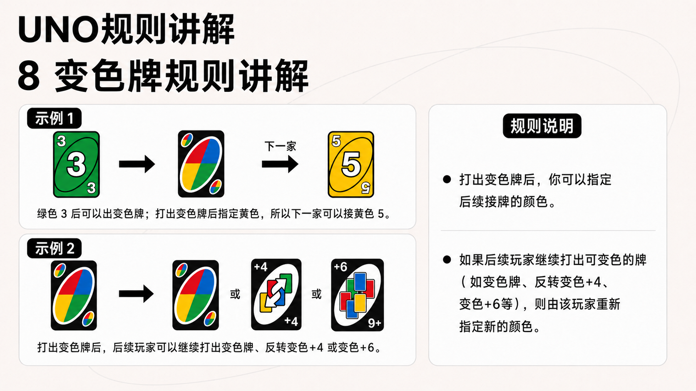

### 罚抽

打出后指定一种颜色，目标玩家需要一直从牌堆摸牌，直到摸到指定颜色为止。罚抽目标永远是当前出牌方向上的下一位玩家。

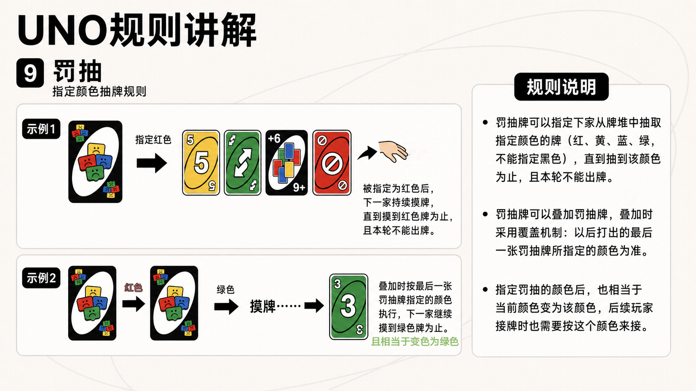

### 反转变色 +4

反转方向、指定颜色，并让新的目标玩家承受 +4 压力。

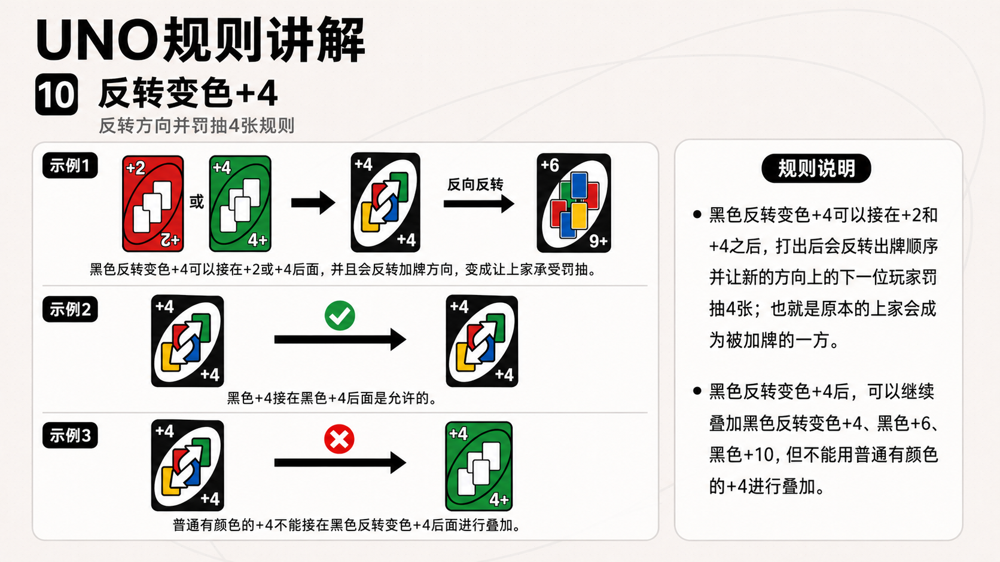

### 变色 +6

指定颜色，并让目标玩家承受 +6 压力。

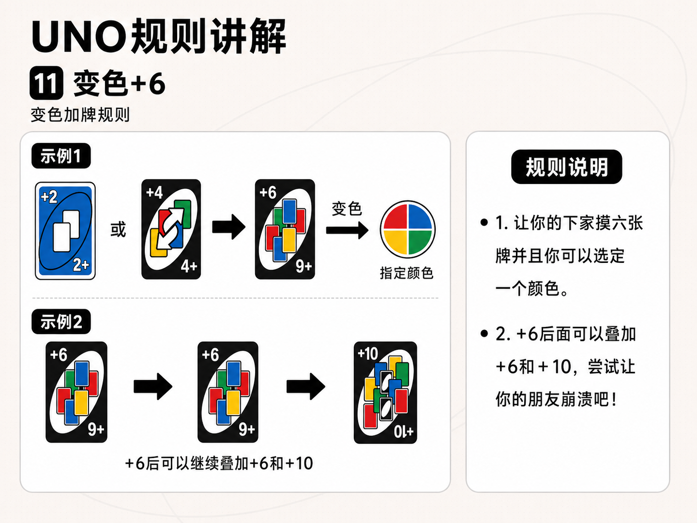

### 变色 +10

指定颜色，并让目标玩家承受 +10 压力。第二张 +10 有特殊抵消效果，会清空前面的加牌链。

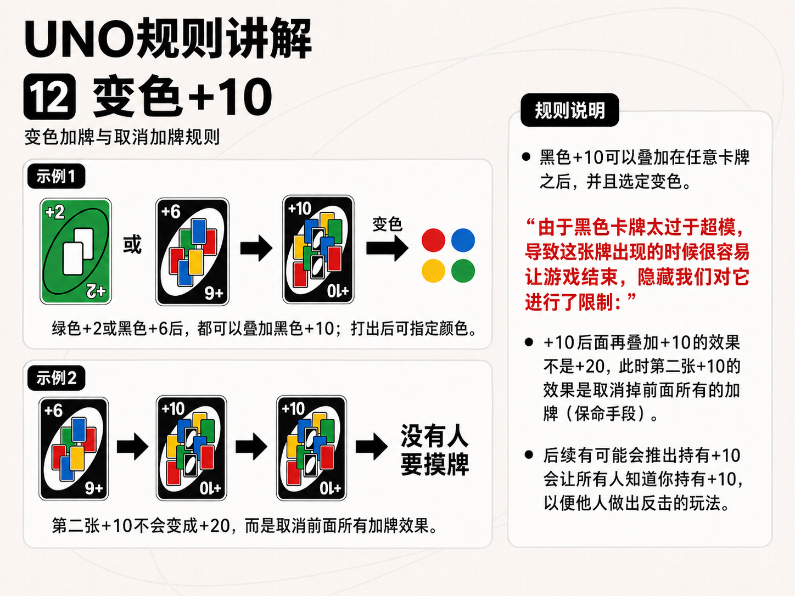

## 特色玩法

### 顺子

顺子只能由普通数字牌组成，至少 5 张，数字必须连续，颜色不限。下一家需要接顺子中最大的那张牌。

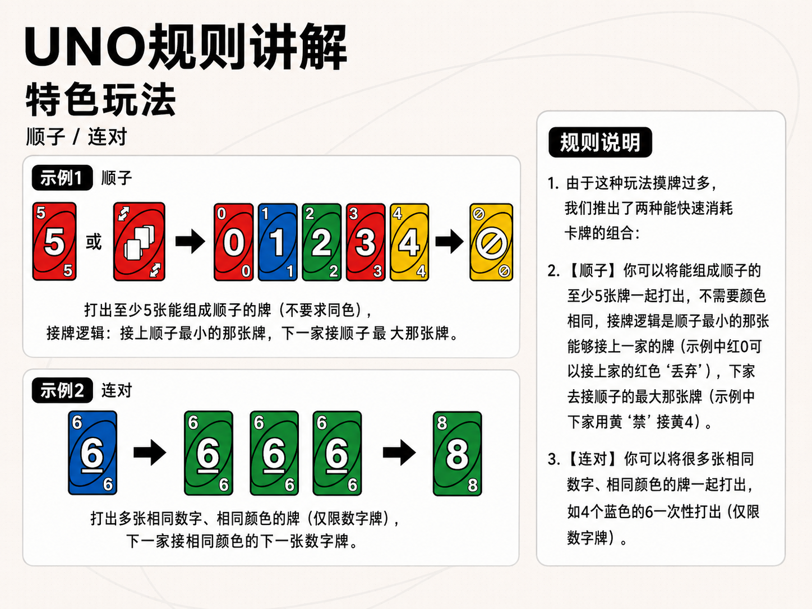

### 连对

连对只能由普通数字牌组成，要求颜色相同、数字相同，可以一次性打出多张。

### UNO

当玩家出牌后只剩 1 张手牌，需要喊 UNO。系统提供短暂保护时间，保护结束后如果仍未喊 UNO，其他玩家可以抓 UNO。抓 UNO 成功后，目标玩家罚摸 6 张。

## 质疑玩法

房间选择“有质疑规则”时，普通摸牌会产生质疑窗口。

核心规则：

- 如果玩家摸牌前手里有黑色牌，却选择普通摸牌，其他人可以质疑。
- 质疑成功：被质疑者罚摸 2 张。
- 质疑失败：质疑者罚摸 6 张。
- 质疑窗口持续到下一家完成行动前。

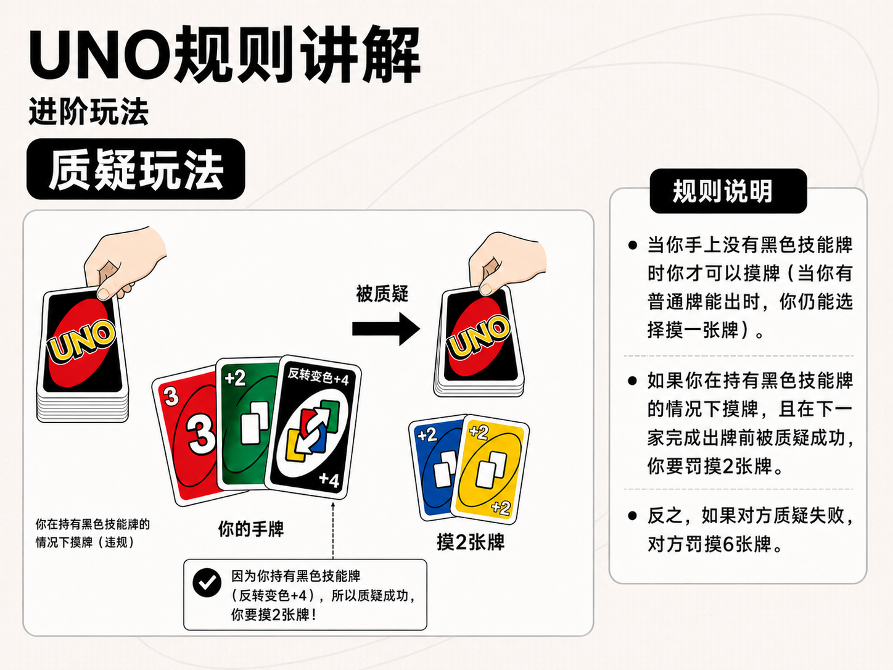

## 本地启动

需要先安装 Node.js 20.11 或更高版本，并启用 corepack。

安装依赖：

```bash
corepack pnpm install
```

启动服务端：

```bash
corepack pnpm --filter @thunder-uno/game-server dev
```

启动网页端：

```bash
corepack pnpm --filter @thunder-uno/client-web dev
```

默认访问地址：

```txt
http://localhost:5173
```

默认 WebSocket 地址：

```txt
ws://localhost:8787
```

如果网页端端口被占用，Vite 可能会自动改用 `5174` 等端口，以终端实际输出为准。

## 局域网联机

电脑和手机必须在同一个局域网内。

服务端监听所有网卡：

```bash
HOST=0.0.0.0 PORT=8787 corepack pnpm --filter @thunder-uno/game-server dev
```

网页端监听所有网卡：

```bash
corepack pnpm --filter @thunder-uno/client-web dev -- --host 0.0.0.0
```

其他设备访问：

```txt
http://电脑局域网IP:5173?ws=电脑局域网IP:8787
```

示例：

```txt
http://192.168.1.23:5173?ws=192.168.1.23:8787
```

如果无法连接，优先检查：

- 手机和电脑是否在同一局域网。
- Windows 防火墙是否放行 5173 和 8787。
- 网页 URL 里的 `?ws=` 是否指向正确电脑 IP。
- 服务端是否真的启动在 8787。

## 生产预览

构建网页端：

```bash
corepack pnpm --filter @thunder-uno/client-web build
```

启动预览：

```bash
corepack pnpm --filter @thunder-uno/client-web preview
```

`preview` 默认端口通常是 4173：

```txt
http://localhost:4173
```

局域网访问时同样需要带上服务端地址：

```txt
http://电脑局域网IP:4173?ws=电脑局域网IP:8787
```

## 常见问题

### 点击按钮没有反应

先确认页面左上角连接状态是否为“已连接”。如果显示“重新连接”，说明网页端没有连上服务端。

### 加入房间失败

房间号必须是 6 位数字，并且服务端里确实存在该房间。确认房主没有关闭服务端或刷新导致房间丢失。

### 添加机器人报 Unknown client message type

这通常说明你连接的是旧服务端。关闭占用 8787 的旧 Node 进程后，重新启动服务端。

### 别人打不开网页

本机的 `localhost` 只能自己访问。其他设备要用电脑的局域网 IP，例如：

```txt
http://192.168.1.23:5173?ws=192.168.1.23:8787
```

### 规则和标准 UNO 不一样

这是正常情况。《雷霆 UNOplus》使用自定义规则，尤其是加牌链、罚抽、同色丢弃、顺子、连对、质疑玩法都和标准 UNO 不同。
