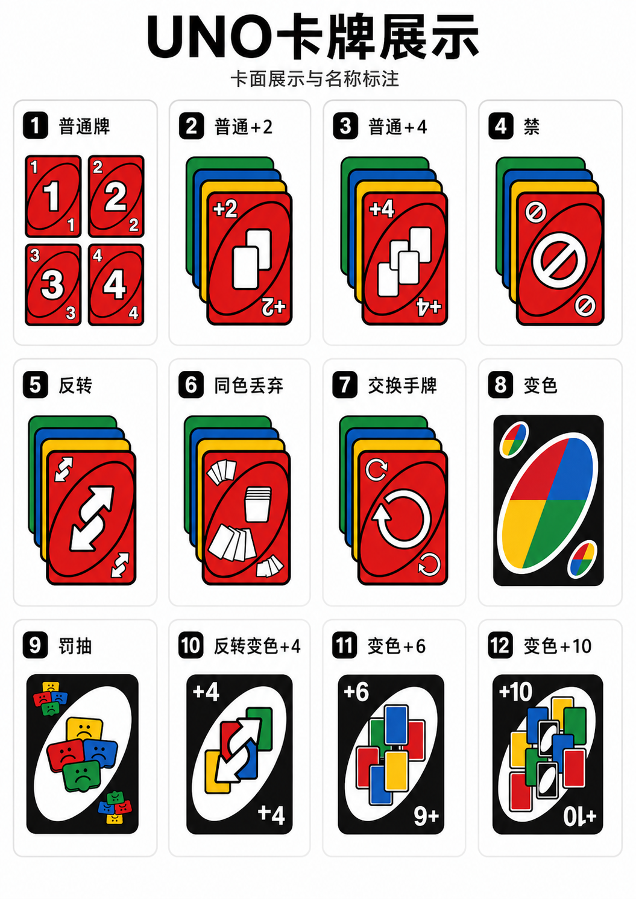

# 雷霆 UNOplus 玩家说明

这不是标准 UNO 的网页复刻，而是一套把“加牌链压迫感、黑牌爆发、同色丢弃、顺子连打、连对抢节奏、UNO 抓人、质疑反制”揉在一起的实时多人卡牌对战。你可以把它理解成更凶、更快、更容易突然翻盘的 UNOplus：一张牌可能只是接色，另一张牌可能直接改方向、换手牌、清空加牌链，甚至让下一家一路摸到指定颜色为止。



《雷霆 UNOplus》的核心特色，是把传统 UNO 的轻量规则扩展成少见的“高互动、高惩罚、高反转”玩法。当前支持 3 到 8 人网页端实时联机，玩家创建房间后，把 6 位房间号发给其他人即可一起对战；无质疑模式下也可以加入机器人陪打。

玩法亮点：

- 全网少数将多种自定义 UNO 机制整合到同一套网页实时对战里的版本。
- 加牌不只是 +2、+4：还有黑色 +6、+10、反转变色 +4，以及可叠加、可抵消的加牌链。
- 黑牌不只是变色：罚抽会让目标玩家一直摸到指定颜色，局势可能瞬间失控。
- 不只打一张：同色丢弃、顺子、连对让玩家可以一次甩出多张手牌，节奏比标准 UNO 更爆。
- 有质疑模式：摸牌也可能被抓，黑牌、心理战和风险判断都会影响每一步选择。
- 支持网页联机和机器人对局，适合本地试玩、局域网开房和规则迭代测试。

规则以本项目的自定义规则为准，不是标准 UNO。完整规则可继续查看 [GAME-RULES.md](./GAME-RULES.md)，牌库配置可查看 [CARD-CONFIG.md](./CARD-CONFIG.md)。

## 文档总览

项目开发过程、阶段交付、问题拆解和修复记录，已经整理成可直接打开的 HTML 总览页：

- [docs/index.html](./docs/index.html)：文档总入口
- [docs/phase-overview.html](./docs/phase-overview.html)：全部 Phase 文档总览
- [docs/problem-overview.html](./docs/problem-overview.html)：全部 Problem 文档总览

这些页面支持分板块浏览、按钮展开具体内容，也保留了原始 Markdown 文档入口。

## 快速开始

1. 打开网页。
2. 输入昵称。
3. 点击“生成房间号”创建房间，或输入别人给你的 6 位房间号加入房间。
4. 非房主点击“准备”。
5. 所有人准备后，房主点击“开始游戏”。
6. 轮到自己时，选择高亮手牌出牌，或点击摸牌。

房主还可以在大厅踢出玩家或机器人。机器人只能在“无质疑规则”模式下添加。

## 这不是标准 UNO

这套规则不是“标准 UNO 搬到网页上”，而是一个高压、连锁、多人节奏更强的变体。完整规则仍以 [GAME-RULES.md](./GAME-RULES.md) 为准，这里只列和基础 UNO 明显不同、最容易影响实战判断的部分。

## 和基础 UNO 不同的地方

- 目标不只是先出完牌。玩家手牌一旦超过 25 张，会直接被淘汰。
- 一局结束后不一定立刻散房。房主可以选择重开一把或继续游戏；如果房主淘汰后主动离房，权限会顺移，满足条件时还会自动继续。
- 无质疑模式下支持机器人补位，而且现在区分 `最强bot` 和 `混沌bot` 两种类型。

## 新增牌型与黑牌

- 除了标准数字牌、跳过、反转之外，这里还有 `同色丢弃`、`交换手牌`、`罚抽`、`反转变色 +4`、`变色 +6`、`变色 +10`。
- `同色丢弃` 允许你打出主牌后，额外甩掉同颜色的若干张牌，但真正留在桌面上供下一家接的是主牌。
- `交换手牌` 会按当前方向重分所有人的手牌，是中后盘最容易翻桌的牌之一。
- `罚抽` 不是普通加牌。目标玩家会一直摸，直到摸到你指定的颜色为止。
- `变色 +10` 的第二张有抵消效果，会把前面的加牌链直接清空。

## 加牌链差异

- 这套规则里的加牌链比基础 UNO 更重。普通 `+2`、普通 `+4`、黑色 `+6`、黑色 `+10`、反转变色 `+4` 都可能进入同一条压力链。
- 彩色加牌只能按同类继续叠，黑色加牌可以向上升级，但不能降级覆盖。
- `+10` 在高压残局里不是单纯更大的加牌，它还会改变整条链的可回应方式。

## 多人组合玩法

- `顺子`：至少 5 张普通数字牌，数字连续，颜色不限。下一家要接顺子里最大的那张牌。
- `连对`：普通数字牌的同色同点数多张一起打出。
- `同色丢弃`：把同颜色手牌压缩成一回合处理，适合大手牌减压或临门清手。

## 淘汰 / 继续游戏 / 房主决策

- 玩家被打到 25 张以上会立刻淘汰，但不会从房间信息里消失。
- 出现胜利或淘汰后，对局会进入回合决策阶段，由房主决定 `重开一把` 或 `继续游戏`。
- 如果房主在这个阶段主动离房，房主顺位会转给下一位仍在房间中的玩家；若仍有至少两名活跃玩家，服务端会自动继续，不再卡住全房。

## 质疑玩法

- 只有在“有质疑规则”模式下才会出现。
- 如果玩家摸牌前其实手里有黑牌，却选择普通摸牌，其他玩家可以发起质疑。
- 质疑成功：被质疑者罚摸 2 张。
- 质疑失败：质疑者罚摸 6 张。
- 质疑窗口会持续到下一家完成行动前，所以节奏判断比标准 UNO 更重要。


## 机器人类型

- `最强bot` 使用偏稳的 `greedy-v1` 策略，优先按手牌价值、加牌压力和出牌效率做决策。
- `混沌bot` 使用 `chaos-v1` 策略，会主动追求更乱、更狠的出牌点，比如压对手缺色、抓不可叠加的加牌窗口、利用换手牌和反转制造突然翻盘。

## 本地启动

只保留最基础的本地运行方式。

1. 安装依赖：
```bash
corepack pnpm install
```

2. 启动服务端：
```bash
corepack pnpm --filter @thunder-uno/game-server dev
```

3. 新开一个终端，启动网页端：
```bash
corepack pnpm --filter @thunder-uno/client-web dev
```

4. 浏览器打开：
```txt
http://localhost:5173
```

默认情况下，网页端会连接：
```txt
ws://localhost:8787
```
